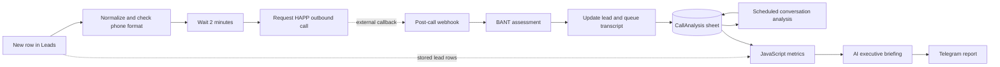

# RevenuePulse AI

**Voice lead qualification, conversation analysis and executive reporting — built with n8n.**

[](https://github.com/vladyslav-moskalkov/revenuepulse-ai/actions/workflows/validate.yml)

An educational B2B sales prototype connecting **HAPP, gpt-5-mini, Google Sheets and Telegram**. Three workflows turn incoming lead rows into outbound-call requests, structured conversation assessments and a concise CEO briefing.

**Demonstration prototype, not a client deployment.** Exports are inactive and sanitized. Offline checks do not place calls, invoke models or certify live integrations.

## Business context

The scenario assumes a B2B service company receiving **15–25 leads/day**, with **three sales managers and one supervisor**. These are planning assumptions, not observed customer figures.

Manual qualification makes it difficult to consistently capture budget, decision-making authority, need and timing. Managers also need a readable view of call outcomes without reviewing every conversation themselves.

The prototype demonstrates a shared workflow: initiate a qualification call, retain its context, analyze the conversation, and present the available metrics with suggested follow-up actions. Revenue improvement and time savings have not been measured.

## What is included

| Workflow | Nodes | Responsibility |
| --- | ---: | --- |
| [Lead qualification](workflows/lead-qualification.json) | 12 | Normalize a new lead, request a HAPP call, accept its callback and queue the transcript |
| [Daily call analysis](workflows/daily-call-analysis.json) | 7 | Read pending conversations, produce structured BANT analysis and update the analysis sheet |
| [CEO report](workflows/ceo-report.json) | 10 | Calculate row-based metrics in JavaScript, generate an AI briefing and format it for Telegram |

**29 nodes · 5 JavaScript Code nodes · 3 gpt-5-mini model nodes · 2 structured output parsers.**



The call request and callback are **separate executions**. HAPP assistant configuration is external and is not included in these exports. Google Sheets connects the three workflows; there are no inter-workflow execution nodes.

## Evidence and validation

The [portfolio](https://vladyslav-ai-automation.notion.site/AI-Automation-Portfolio-3917a4cb52cc81408f7cebb09a5d14ce) and [Ukrainian demo](https://www.loom.com/share/891cd4905a6c47feb0b630a590b36154) provide the case narrative. Its reported MVP sample contains six leads and five completed calls; source execution logs were not supplied for this repository audit.

[Synthetic examples](examples/demo-data.json) independently reproduce **6 lead rows, 5 analyzed conversations, an average AI score of 68, and a 40% successful-conversation share** using the exported JavaScript. They are invented test data, not customer results or a new live benchmark.

```sh
npm test
```

**64 offline checks** run on Node.js 22+; no dependency installation, credentials or external services required. See [validation scope](docs/VALIDATION.md). Some checks characterize known defects rather than assert production correctness.

## Read before running

This is a **source-preserving demonstration**, not a production-ready template. Important findings are documented in [known limitations](docs/KNOWN-LIMITATIONS.md):

- The weekly trigger currently reports all available rows, not a date-filtered week.
- `conversion_rate` means successful analyzed conversations / analyzed conversations; it is not sales conversion.
- Initial and daily scoring use different temperature thresholds; BANT sums are requested by prompts, not enforced by code.
- The daily write maps `transcript` from `summary`, risking loss of the original transcript.
- Callback authentication, missing-ID handling, duplicate-call protection and centralized failure handling need hardening before activation.

## Project guide

- [Architecture and metric definitions](docs/ARCHITECTURE.md)
- [Import, credentials and test setup](docs/SETUP.md)
- [Security and privacy](SECURITY.md)
- [Audit findings and launch gates](docs/KNOWN-LIMITATIONS.md)
- [Offline validation and source provenance](docs/VALIDATION.md)

Documentation is English; workflow names, prompts and report text remain Ukrainian to preserve the supplied implementation. This package does not claim an English-language voice agent.

## Author

[Vladyslav Moskalkov](https://github.com/vladyslav-moskalkov) · AI Automation Specialist  
[Portfolio](https://vladyslav-ai-automation.notion.site/AI-Automation-Portfolio-3917a4cb52cc81408f7cebb09a5d14ce) · [LinkedIn](https://www.linkedin.com/in/vladyslav-moskalkov/)
